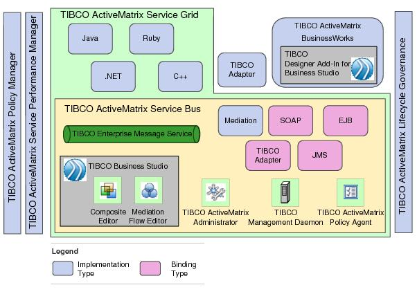
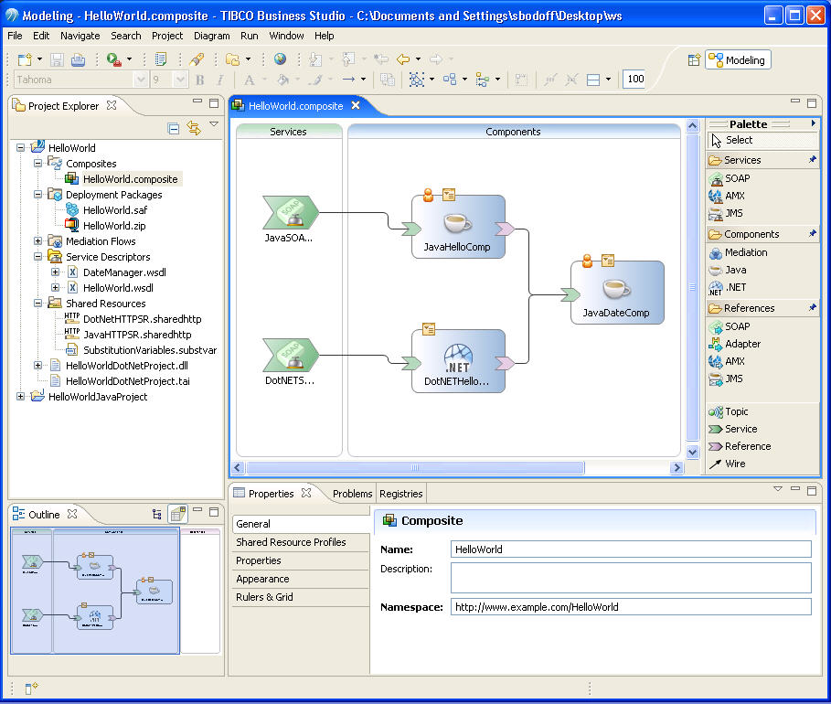

:data-uri:
:toc2:
:rhtlink: link:https://www.redhat.com[Red Hat]

image::images/rhheader.png[width=900]

:numbered!:
[abstract]
== TIBCO to JBoss Reference Architecture

:numbered:

== Overview
In this document we will present a discussion of TIBCO's offerings in the SOA/BPM space and how RedHat products compare. Some strategies for migration from TIBCO to RHT will be discussed, as well as a proposal for how and where automated tools could be built to ease the manual migration or re-writes.

== TIBCO products and the RedHat counterparts

_In which the TIBCO products and their RedHat equivalents are discussed_

=== SOA

TIBCO's flagship integration server is BusinessWorks (BW) and its service orchestration platform is Active Matrix (AMX). AMX bundles 

* AMX Service Bus, an ESB offering
* AMX Service Grid, a service composition layer based on SCA that can host and run heterogenous services (Java, BPEL, BW, etc.)
* AMX Business Works, which offers BW functionality in the AMX fabric
* adapters to file, DB and ERP systems that run inside AMX containers
+

Fuse Service Works is the corresponding product in the JBoss M/W suite. It can integrate heterogenous services implemented as Camel routes, Java beans, BPEL, BPMN and Drools using an SCA framework. FSW runs on JBoss EAP, whereas AMX runs its service engines in individual JVMs.

From an ESB perspective, the offering is BusinessWorks. BW standalone is focused on process orchestration and includes capabilities to:

* design business processes, import schemas and define mapping between them in a WYSIWYG manner
* ability to connect to different databases and applications by using plug-ins or adapters
* ability to monitor and administer these processes

+

BW 5.x (standalone) has been a very popular offering and has the highest number of deployments. Starting with BW 5.8, BW is sold as AMX-BW, part of the AMX stack of offerings. The latest offering BW 6.1 moves away from the AMX stack. The adoption curve for AMX as a platform was not strong and hence TIBCO moved away from it for its latest offering. This is a relatively new offering; existing customers will face challenges in migrating off older versions. Upgrade path from 5.x does not exist. This is a new engine that is different from the old standalone BW engine and the AMX container engine. This is an opportunity to insert a competitive product at the customer since there is going to be a complex migration path. It is possible that TIBCO PSG may present a migration strategy/solution to the customer but that is a manual migration and involves engaging TIBCO PSG resources;

The original AMX (pre-6.0) suffered from a large installation and memory footprint. In that regard, BW 6.0 might be an improvement, but in general, it is complex to use. Customers do not have a BW-like user experience, since configuring AMX has always been a challenge. Performance in AMX 5.x suffered and is unlikely to be much better this go around. A lot of attrition in this engineering group affecting TIBCO's ability to improve performance and user experience.

Comparable offering from Red Hat is JBose Fuse.

=== Messaging
TIBCO has multiple products for messaging: RV, EMS and FTL. RV is the original proprietary publish-subscribe messaging protocol which is heavily used where low latency is desired, but 
JBoss A-MQ and TIBCO EMS are messaging server technologies. Key differentiators for A-MQ are:

* multi-protocol
* low footprint and available in an embedded version
* price advantage owing to subscription model

=== BPM and Rules

TIBCO has two main BPM offerings

* iProcess Suite
* AMX-BPM

iProcess Suite is an end-to-end BPM suite which has been out of development for over 3 years now. However, it has the most market penetration since the adoption of AMX-BPM has been slow. There is no pre-built migration available from iProcess to AMX-BPM, which presents an opportunity to migrate over iProcess customers to BPMS. 

For business rules, TIBCO has two offerings

* BusinessEvents
* StreamBase

BusinessEvents provides CEP rules as well as decision tables. The suite includes a distributed in-memory datagrid, ActiveSpaces. It also has the ability to track the states of an order, package using its state machine.

TIBCO Streambase is focused on ESP; finding patterns in a sequence of events or over a time window.

TIBCO leads with fast data and the 2 second advantage messaging: the backbone of that strategy has been BusinessEvents which has been de-emphasized in favor of StreamBase. It is unclear to customers which event processing technology to select. Both products solve different problems and this is causing confusion with customers.

The comparable product in the JBoss Suite would be BPMS/BRMS. 

== TIBCO vs RHT - strengths and weaknesses

_goes into detail about the product architectures that sets up the discussion of migration ahead as well provides comparison points around strengths and weaknesses_

For the present, we will focus the discussion on the SOA integration suite as well as the BPM and rules components.

=== SOA or pure A2A integration

TIBCO BusinessWorks 5.x can run in its own container (stand-alone) or inside a jvm (AMX-BW). In mid-2014, BW 6.0 was released whic moves away from the AMX architecture. A BW project is composed of 

* schemas which are imported in as .xsd, .dtd and a few other formats
* mappings that are defined in the mapper of the TIBCO Designer and stored as .xslt in the repo
* adapter, JDBC, JMS configurations to define connectivity to external systems and applications
* process stored in proprietary XML format (BPEL is supported)
* Java code that can be invoked through BW activities

The BW process orchestrates the flow between the edge systems and has tasks focused on mapping, connecting to edge systems and business logic.

The entire project is exported as a .ear file (different from JBoss format) which contains a .par (Process archive). This .ear file is imported by the TIBCO Administrator and deployed. Basic monitoring abilities are provided by the TIBCO Administrator.

TIBCO AMX is a full-featured SCA component suite. It has the ability to run several service engines within a container, deploy and manage them in a unified manner. Some of the key containers are:

* ESB providing content transformation, routing and mediation
* Business process orchestration using BW container
* Service grid for integrating heterogenous services (Java, Ruby, etc.)

Unlike Fuse and FSW, the AMX and BW designers are not Eclipse-based. The Business Studio UI used for designing BPM processes in AMX-BPM, however, is Eclipse-based. As of BW 6.0, the new designer tool is Eclipse-based, although the majority of customers have the version with the customer Designer. 

AMX provides support for .NET services whereas JBoss is Java-centric.

The standalone version of BW runs in its own engine, as opposed to AMX which run inside the Service Grid container. 

A BW project is exported as a .ear file, but it is not a standard EJB .ear file. 

TIBCO provides a number of (150+) adapters out of the box. These are standalone executables that run as .exe's or in jvms. Of these, only a small number (File adapter, SAP, DB) are available for the latest 6.1 release of BW. Fuse includes the Camel ESB, which has a number of adapters available as camel components. 

=== Rules and BPM

AMX-BPM, based on the Active Matrix service fabric, has support for developing business processes in BPMN 2.0. These processes are accessible externally as services. A complex business process can be built by using a combination of AMX-BPM, BW and custom code.

The JBoss BPM and rules offering is completely integrated out of the box. In TIBCO, the CEP functionality is available as a separate product SKU. Business Events rules are designed and deployed in its own engine and are loosely coupled with the SOA/BPM products. Decision tables are available as callable libraries inside BW and AMX-BPM. 

For rules, TIBCO has two offerings currently: Streambase (acquisition) and BusinessEvents (home-grown). Streambase is focused on event-stream processing (ESP) and can be configured to look for patterns in events. It is possible to define a window of time in which events can be gathered and correlated. BusinessEvents is based on a RETE engine that does forward-chaining to predict potential opportunities or hazards.

== Migration Strategies

_in which tips are provided for migrating artifacts that are relatively easy to move from TIBCO to JBoss_

TIBCO BPM implementations in the field consist chiefly of iProcess (legacy) and the new AMX-BPM product, which is based on the AMX foundational layer. A number of customers are or will be in the process of migrating their legacy iProcess implementations to AMX-BPM. TIBCO has started selling a migration tool and services package for this. This tool is as yet untested in the market. There is an opportunity to go after the TIBCO migration effort by providing such a migration tool. One of the larger SIs has built a tool that migrates assets between iProcess and AMX_BPM. It has been architected using XSLT to move from one native TIBCO format to another. Working with partners who have a sandbox running one or more of the TIBCO integration/BPM platforms, we could build a tool in collaboration that moves assets between TIBCO and JBoss Fuse or other products.

TIBCO BW and AMX-BW have built-in tooling for data mapping. This is not available in Fuse currently. Mappings exported out of TIBCO as XSLT 1.0 can be imported into the Fuse Service Works XSLT transformer as per link(https://github.com/jboss-gpe-ref-archs/fsw_external_mapping).

TIBCO EMS has been integrated into EAP 6.x. Use the tibjms.jar, tibcrypt.jar.

=======
